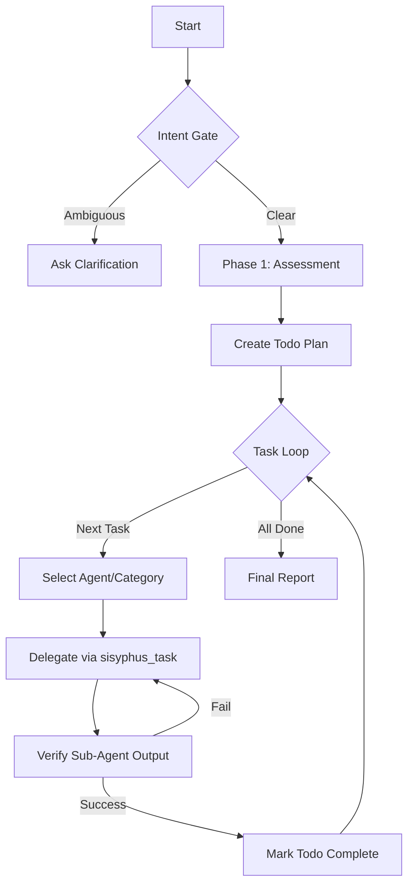
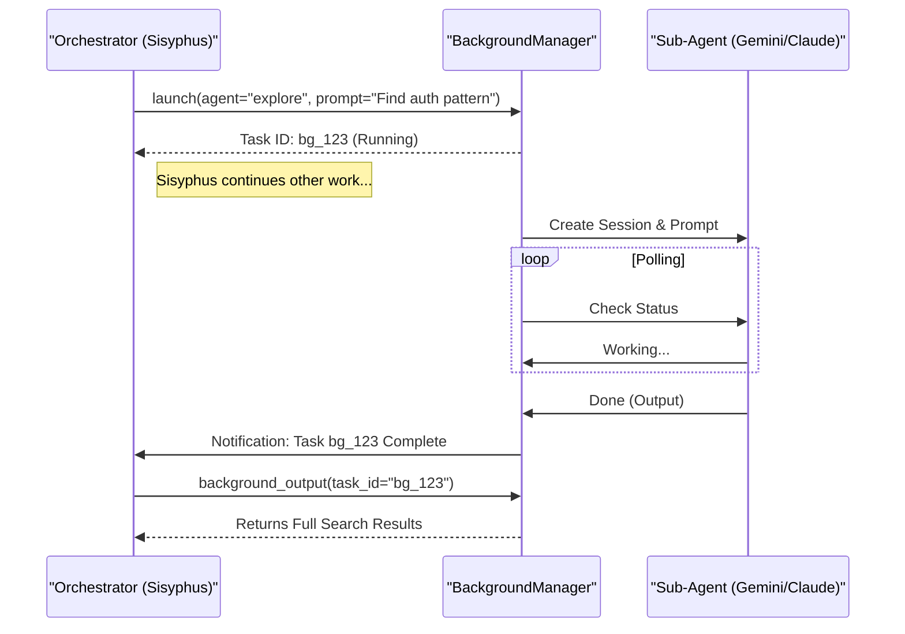

# The Architecture of Sisyphus: Engineering the Perfect Agent Harness

**Date:** 2026-01-09
**Target Audience:** Architects, Senior Engineers, AI Systems Designers

## 1. Executive Summary: Why "Sisyphus"?

Most AI coding assistants fail because they are designed as **tools**, not **systems**. They wait for user input, execute one command, and stop. This "chat-response" cycle breaks flow and places the cognitive burden of state management on the human user.

**Sisyphus** is an **orchestration harness** designed to invert this control. Instead of a passive tool, it acts as an active **loop**:

1.  **State Persistence:** It maintains its own todo list and project context, independent of the chat window.
2.  **Self-Correction:** It verifies its own work (tests, linting) before reporting success.
3.  **Relentless Execution:** It uses a "Todo Continuation Enforcer" to auto-resume work until the job is done.
4.  **Parallelism:** It dispatches specialized sub-agents (frontend, backend, research) to work asynchronously.

This document details the engineering architecture that makes Sisyphus the "Best Agent Harness."

---

## 2. Core Architecture: The Orchestrator Loop

At the heart of Sisyphus is the **Orchestrator Agent** (`src/agents/orchestrator-sisyphus.ts`). Unlike standard agents, it is explicitly forbidden from writing code. Its sole purpose is **management**.

### 2.1 The Orchestrator Protocol

The Orchestrator follows a strict state machine, enforced by system prompts and hooks:



### 2.2 The "Bouldering" Mechanism

The "Bouldering" mechanism (`src/hooks/sisyphus-orchestrator`) is what separates Sisyphus from standard chat bots. It intercepts the `session.idle` event to prevent the agent from stopping prematurely.

**Pseudocode Logic:**

```typescript
// src/hooks/sisyphus-orchestrator/index.ts (Simplified)

onEvent("session.idle", (session) => {
  const boulderState = readBoulderState(directory);

  if (!boulderState || boulderState.isComplete) return;

  // If the agent thinks it's done but the plan isn't empty:
  const incompleteTasks = boulderState.total - boulderState.completed;

  if (incompleteTasks > 0) {
    // FORCE CONTINUATION
    injectSystemMessage(session, `
      [SYSTEM REMINDER - BOULDER CONTINUATION]
      You have an active work plan with ${incompleteTasks} incomplete tasks.
      Continue working.
      RULES:
      - Proceed without asking for permission
      - Mark [x] when done
      - Do not stop until all tasks are complete
    `);
  }
});
```

**Why this matters:** It eliminates the "lazy agent" problem where LLMs claim to be finished after doing 10% of the work.

---

## 3. Parallelism & Background Agents

Sisyphus treats agent context as a scarce resource. Instead of stuffing one session with search results, docs, and code, it offloads work to **Background Agents**.

### 3.1 The Async Dispatch Model

The `BackgroundManager` (`src/features/background-agent/manager.ts`) allows the Orchestrator to "fire and forget" tasks.

**Sequence Diagram:**



### 3.2 Stability Detection

Since LLMs don't always reliably report "done" via API states, the `BackgroundManager` implements a **Stability Heuristic**:
- It polls the sub-agent session.
- If the message count remains unchanged for **3 consecutive polls** (approx. 6 seconds) AND valid output exists, the task is deemed complete.

---

## 4. Context Engineering: Dynamic Injection

Static context windows are the enemy of large codebases. Sisyphus uses **Dynamic Injection** hooks to provide "Just-In-Time" context.

### 4.1 Directory Walking Injectors

When an agent reads a file, Sisyphus automatically injects relevant documentation found in the file's path.

**Implementation (`src/hooks/directory-agents-injector`):**

1.  **Intercept:** `tool.execute.after` for `read` tool.
2.  **Walk:** Traverse up from the target file's directory.
3.  **Detect:** Look for `AGENTS.md` (instructions) or `README.md`.
4.  **Inject:** Append the content to the `read` tool's output.
5.  **Cache:** Remember this file to avoid re-injecting it in the same session.

**Result:**
If `src/auth/AGENTS.md` says *"Always use Bcrypt"*, and the agent reads `src/auth/login.ts`, it *immediately* sees that rule without you pasting it.

### 4.2 Dynamic Truncation

To prevent context explosion, the `DynamicTruncator` monitors the session size. If a README is too large, it automatically summarizes or truncates it before injection, ensuring the "critical path" context (the code itself) remains prioritized.

---

## 5. Reliability Patterns

Sisyphus assumes LLMs are unreliable, lazy, and hallucinate. The architecture is built defensively.

### 5.1 Verification Enforcement

The Orchestrator's system prompt mandates a "Trust But Verify" protocol.

**The Verification Checklist:**
- **Code:** Run `lsp_diagnostics` on every changed file.
- **Tests:** Run `bun test` (or equivalent).
- **Files:** Use `glob` to confirm files actually exist.

If an agent reports "Done" but `lsp_diagnostics` returns errors, the Orchestrator **rejects** the completion and commands a fix.

### 5.2 Todo Continuation Enforcer

A dedicated hook (`src/hooks/todo-continuation-enforcer.ts`) monitors the session for idleness.

- **Trigger:** `session.idle` event.
- **Check:** Are there unchecked items in the `ai-todo` file?
- **Action:**
    1.  Show a "Resuming in 2s..." toast in the TUI.
    2.  Inject a continuation prompt.
- **Result:** The agent physically cannot quit until the todo list is empty.

---

## 6. Tooling Abstraction: Giving Agents an IDE

Sisyphus provides agents with "IDE-grade" tools, not just text editors.

### 6.1 LSP (Language Server Protocol) Integration

Agents usually just "grep". Sisyphus gives them semantic understanding via `src/tools/lsp/`:

- `lsp_goto_definition`: "Where is this function defined?" (Exact location, not a text search).
- `lsp_find_references`: "Who calls this function?" (Confident refactoring).
- `lsp_diagnostics`: "Did I break anything?" (Real-time feedback).

### 6.2 AST-Grep (Structural Search)

Regex is fragile. Sisyphus integrates **ast-grep** to allow structural search and replace.
- *Query:* `sg --pattern 'function $NAME($ARGS) { return $VAL }'`
- *Matches:* Semantically equivalent code, ignoring whitespace/comments.

---

## 7. Conclusion: The "Batteries-Included" Difference

Sisyphus isn't just a prompt; it's a **runtime environment**.

| Feature | Standard Agent | Sisyphus |
| :--- | :--- | :--- |
| **Execution** | Linear (Chat) | Looped (Orchestrator) |
| **Context** | Manual/Static | Dynamic Injection |
| **Tasking** | Single Thread | Async/Parallel |
| **Completion** | "I think I'm done" | "Tests pass, Linting clean, Todos checked" |
| **Tooling** | Grep/Sed | LSP/AST-Grep |

By enforcing these engineering patterns in code (Hooks, Managers, Tools), Sisyphus transforms the LLM from a chatty assistant into a **disciplined software engineer**.
