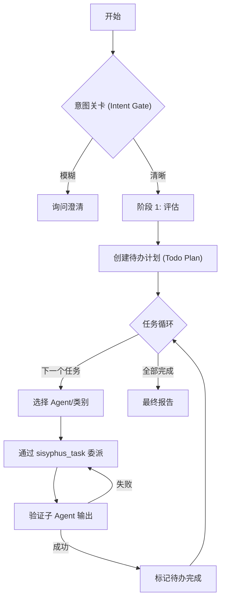
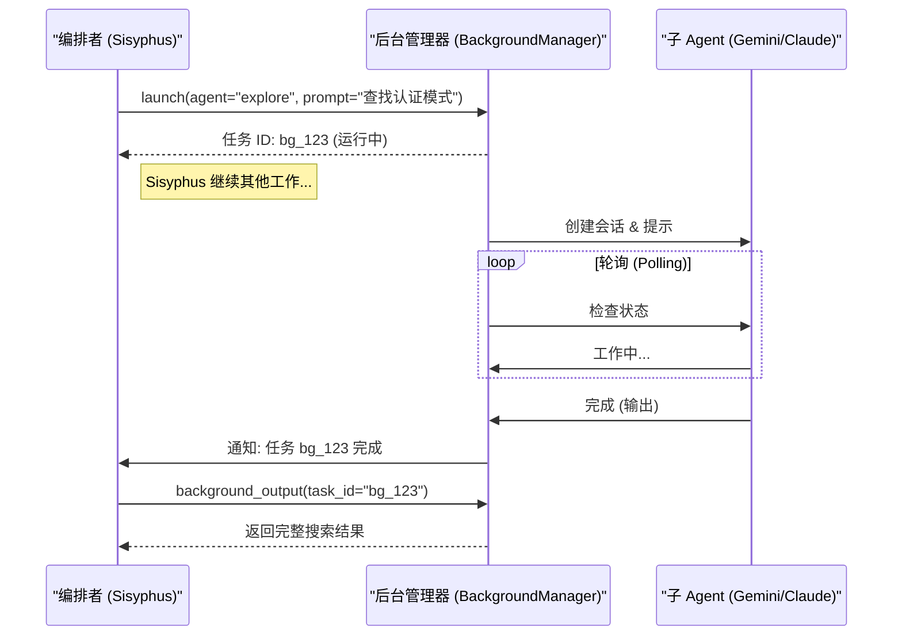

# Sisyphus 架构解析：打造终极 Agent 开发环境

**日期:** 2026-01-09
**目标受众:** 架构师, 高级工程师, AI 系统设计者

## 1. 执行摘要：为什么是 "Sisyphus"?

大多数 AI 编程助手之所以失败，是因为它们被设计成了**工具**，而非**系统**。它们等待用户输入，执行一条指令，然后停止。这种“聊天-响应”的循环打断了心流，并将状态管理的认知负担强加给了人类用户。

**Sisyphus** 是一个旨在反转这种控制权的**编排框架 (Orchestration Harness)**。它不再是一个被动的工具，而是一个主动的**循环系统**：

1.  **状态持久化 (State Persistence):** 它维护自己的待办事项列表 (Todo List) 和项目上下文，独立于聊天窗口。
2.  **自我修正 (Self-Correction):** 在报告成功之前，它会自我验证工作成果（运行测试、Lint 检查）。
3.  **持续执行 (Relentless Execution):** 它使用“Todo 延续强制器 (Todo Continuation Enforcer)”自动恢复工作，直到任务全部完成。
4.  **并行处理 (Parallelism):** 它分发专门的子 Agent（前端、后端、研究）进行异步工作。

本文档详细介绍了使 Sisyphus 成为“最佳 Agent 框架”的工程架构。

---

## 2. 核心架构：编排者循环 (The Orchestrator Loop)

Sisyphus 的核心是 **Orchestrator Agent (编排者 Agent)** (`src/agents/orchestrator-sisyphus.ts`)。与标准 Agent 不同，它被明确禁止编写代码。它的唯一目的是**管理**。

### 2.1 编排者协议 (The Orchestrator Protocol)

编排者遵循严格的状态机，通过系统提示词 (System Prompts) 和钩子 (Hooks) 强制执行：



### 2.2 "推石" 机制 (The "Bouldering" Mechanism)

“推石”机制 (`src/hooks/sisyphus-orchestrator`) 是 Sisyphus 区别于标准聊天机器人的关键。它拦截 `session.idle` 事件，防止 Agent 过早停止。

**伪代码逻辑:**

```typescript
// src/hooks/sisyphus-orchestrator/index.ts (简化版)

onEvent("session.idle", (session) => {
  const boulderState = readBoulderState(directory);

  if (!boulderState || boulderState.isComplete) return;

  // 如果 Agent 认为它完成了，但计划并未清空：
  const incompleteTasks = boulderState.total - boulderState.completed;

  if (incompleteTasks > 0) {
    // 强制延续 (FORCE CONTINUATION)
    injectSystemMessage(session, `
      [SYSTEM REMINDER - BOULDER CONTINUATION]
      你有一个活跃的工作计划，尚有 ${incompleteTasks} 个任务未完成。
      继续工作。
      规则:
      - 无需请求许可，直接继续
      - 完成时标记 [x]
      - 直到所有任务完成前不要停止
    `);
  }
});
```

**意义:** 这消除了“懒惰 Agent”问题，即 LLM 仅完成 10% 的工作就声称已完成。

---

## 3. 并行与后台 Agent (Parallelism & Background Agents)

Sisyphus 将 Agent 上下文视为稀缺资源。它不将搜索结果、文档和代码全部塞进一个会话，而是将工作卸载给 **后台 Agent (Background Agents)**。

### 3.1 异步分发模型 (The Async Dispatch Model)

`BackgroundManager` (`src/features/background-agent/manager.ts`) 允许编排者“即发即弃 (fire and forget)”任务。

**时序图:**



### 3.2 稳定性检测 (Stability Detection)

由于 LLM 并不总是通过 API 状态可靠地报告“完成”，`BackgroundManager` 实施了 **稳定性启发式算法 (Stability Heuristic)**：
- 轮询子 Agent 会话。
- 如果消息计数在 **3 次连续轮询**（约 6 秒）中保持不变 且 存在有效输出，则视为任务完成。

---

## 4. 上下文工程：动态注入 (Context Engineering: Dynamic Injection)

静态上下文窗口是大型代码库的敌人。Sisyphus 使用 **动态注入 (Dynamic Injection)** 钩子来提供“即时 (Just-In-Time)”上下文。

### 4.1 目录遍历注入器 (Directory Walking Injectors)

当 Agent 读取文件时，Sisyphus 会自动注入在文件路径中发现的相关文档。

**实现 (`src/hooks/directory-agents-injector`):**

1.  **拦截:** `read` 工具的 `tool.execute.after` 事件。
2.  **遍历:** 从目标文件目录向上遍历。
3.  **检测:** 查找 `AGENTS.md` (指令) 或 `README.md`。
4.  **注入:** 将内容追加到 `read` 工具的输出中。
5.  **缓存:** 记住此文件，避免在同一会话中重复注入。

**结果:**
如果 `src/auth/AGENTS.md` 写着 *“始终使用 Bcrypt”*，当 Agent 读取 `src/auth/login.ts` 时，它会*立即*看到这条规则，无需你手动粘贴。

### 4.2 动态截断 (Dynamic Truncation)

为了防止上下文爆炸，`DynamicTruncator` 监控会话大小。如果 README 太大，它会在注入前自动摘要或截断，确保“关键路径”上下文（代码本身）保持优先级。

---

## 5. 可靠性模式 (Reliability Patterns)

Sisyphus 假设 LLM 是不可靠、懒惰且会产生幻觉的。架构是防御性构建的。

### 5.1 强制验证 (Verification Enforcement)

编排者的系统提示词强制执行“信任但验证 (Trust But Verify)”协议。

**验证清单:**
- **代码:** 对每个更改的文件运行 `lsp_diagnostics`。
- **测试:** 运行 `bun test` (或等效命令)。
- **文件:** 使用 `glob` 确认文件确实存在。

如果 Agent 报告“完成”但 `lsp_diagnostics` 返回错误，编排者会**拒绝**该完成并命令修复。

### 5.2 Todo 延续强制器 (Todo Continuation Enforcer)

一个专用钩子 (`src/hooks/todo-continuation-enforcer.ts`) 监控会话的空闲状态。

- **触发:** `session.idle` 事件。
- **检查:** `ai-todo` 文件中是否有未选中的项目？
- **动作:**
    1.  在 TUI 中显示 “2秒后恢复...” 的 Toast 提示。
    2.  注入延续提示词。
- **结果:** 在待办列表清空之前，Agent 在物理上无法退出。

---

## 6. 工具抽象：给 Agent 一个 IDE (Tooling Abstraction)

Sisyphus 为 Agent 提供“IDE 级”工具，而不仅仅是文本编辑器。

### 6.1 LSP (语言服务器协议) 集成

Agent 通常只用 "grep"。Sisyphus 通过 `src/tools/lsp/` 赋予它们语义理解能力：

- `lsp_goto_definition`: “这个函数在哪里定义的？”（精确位置，不是文本搜索）。
- `lsp_find_references`: “谁调用了这个函数？”（自信重构）。
- `lsp_diagnostics`: “我破坏了什么吗？”（实时反馈）。

### 6.2 AST-Grep (结构化搜索)

Regex 是脆弱的。Sisyphus 集成了 **ast-grep** 以允许结构化搜索和替换。
- *查询:* `sg --pattern 'function $NAME($ARGS) { return $VAL }'`
- *匹配:* 语义等效的代码，忽略空格/注释。

---

## 7. 结论：“电池内置”的差异 (The "Batteries-Included" Difference)

Sisyphus 不仅仅是一个提示词；它是一个**运行时环境**。

| 特性 | 标准 Agent | Sisyphus |
| :--- | :--- | :--- |
| **执行** | 线性 (聊天) | 循环 (编排者) |
| **上下文** | 手动/静态 | 动态注入 |
| **任务** | 单线程 | 异步/并行 |
| **完成标准** | “我想我做完了” | “测试通过，Lint 清洁，Todo 核对” |
| **工具** | Grep/Sed | LSP/AST-Grep |

通过在代码中强制执行这些工程模式（钩子、管理器、工具），Sisyphus 将 LLM 从一个喋喋不休的助手转变为一个**纪律严明的软件工程师**。
